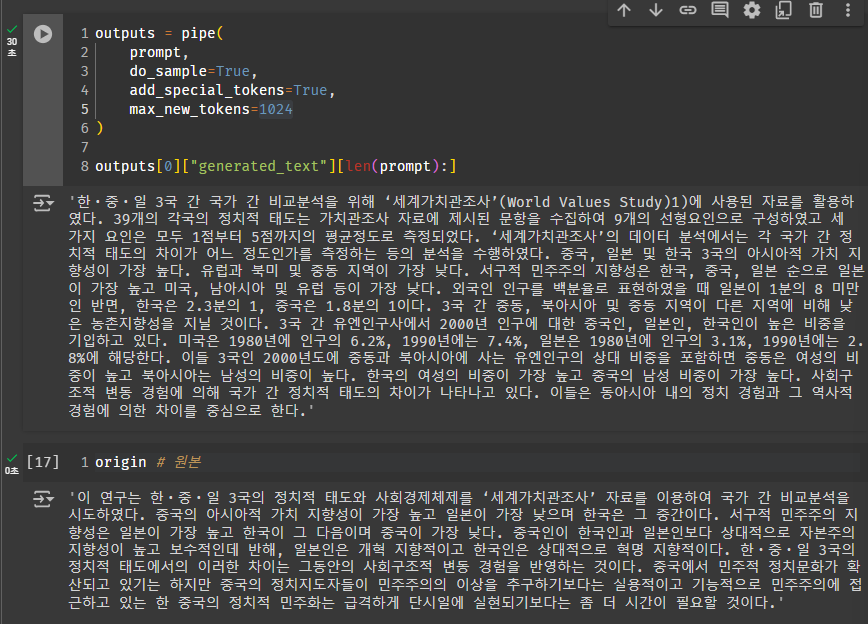

# Gemma-2b-it-Write-My-Paper

<p align="center">
  
</p>

\#GemmaSprint

The WriteMyPaper Gemma-2-2b-it model helps users to write abstracts of papers, fine-tuned by massive datasets of text summarization (each section and entire paper) of korean papers.

---

## Links

- Here are the links of Tutorial of my Code and fineTuned Model uploaded in Hugging Face. Check details below.

[Tutorial] : https://espebaum.github.io/ml/Gemma2FineTuning

[FineTuned Model] : https://huggingface.co/gyopark/gemma-2-2b-it-WriteMyPaper

---

## Description

- This model is a fine-tuned version of the Gemma-2-2B-IT model, tailored for academic paper summarization and generation tasks. It focuses on **processing large-scale academic data to use abstract summaries to generate expanded full abstracts.**

- In brief, trained from abstracts and their summaries, model enables to generate new abstracts when provided with a summary on a specific topic.

## Datasets

<p align="center">
  
</p>

- We used the summary-original pair dataset from AIHub for the abstracts in our project.

[Datasets] : https://www.aihub.or.kr/aihubdata/data/view.do?currMenu=115&topMenu=100&dataSetSn=90

- Original file format was JSON. So Changed in pandas Dataframe and Dataset form can be used in SFTTrainer.

```python
import json
import pandas

# Json 데이터 로드
path = '/content/drive/train_paper.json'

with open(path, 'r', encoding='utf-8') as f:
    data = json.load(f)

# 데이터를 담을 리스트 초기화
documents = []

# 데이터 파싱
for item in data[0]['data']: # 리스트에 들어있는 객체 파싱
    doc = {
        'category': item.get('ipc', ''),
        'title': item.get('title', ''),
        'summary': ' '.join([summary['summary_text'] for summary in item.get('summary_entire', [])]),
        'original': ' '.join([summary['orginal_text'] for summary in item.get('summary_entire', [])])
    }
    documents.append(doc)
```

```
df = pd.DataFrame(documents)
print(df.shape) # (288174, 4)
df.head()

from datasets import Dataset

# pandas 데이터프레임을 Trainer에서 사용하기 위한 dataset 모양으로 변경
dataset = Dataset.from_pandas(df)

print(dataset)
print(dataset[0])
```

<p align="center">
  
</p>

- Finally, We trained with Summary-Original datasets below. Our goal is **generating new original from summary**.

```md
# dataset
Dataset({
    features: ['category', 'title', 'summary', 'original'],
    num_rows: 80000
})

# dataset[0]
{
    'category': '인문학', 
    'title': '중세시대의 對句 학습과 문학 교육', 
    'summary': '對句의 영역은 다양하고, 그 원리는 짝짓기이다. 
    하나의 텍스트가 같은 분포도를 보이는 것은 자연스럽다.',
    'original': '짐작할 수 있는 것처럼, 對句의 영역은 음운, 단어, 어구, 시편의 차원에서 다양하게 이뤄지고 있으며, 그 원리는 짝짓기이다. 
    하나의 텍스트는 음운으로부터 텍스트 자체까지에 이르는 위계적 양상을 보이므로 對句의 영역 또한 같은 분포도를 보이는 것은 퍽 자연스럽다. 
    문제는 텍스트의 전 영역에 걸쳐 짝을 만들어야 한다는 강박증이다. 왜 한시학은 짝짓기에 집착하는가?'
}
```

## Question Pipeline Example

```python
from transformers import AutoTokenizer, AutoModelForCausalLM
import transformers
import torch

model_id = "google/gemma-2-2b-it"
dtype = torch.bfloat16

tokenizer = AutoTokenizer.from_pretrained(model_id)
model = AutoModelForCausalLM.from_pretrained(
    model_id,
    device_map="cuda",
    torch_dtype=dtype,)

# chat prompt

chat = [
    { 
        "role": "user", 
        "content": "Write a hello world program" 
    },
]

prompt = tokenizer.apply_chat_template(chat, tokenize=False, add_generation_prompt=True)
```
- from HuggingFace, we imported gemma-2-2b-it and loaded tokenizer.

- Using `apply_chat_template` in tokenizer, converted `chat` in prompt that can be applied in gemma model

```python
<bos><start_of_turn>user
Write a hello world program<end_of_turn>
<start_of_turn>model
```

## Fine Tuning

### (1) Chat Template

- To append `<eos>` token in chat template. Used custom function that generate Chat template.

```python
# 위에서 pandas Dataframe으로부터 만들었던 dataset을 매개변수로 받는다.

def generate_prompt(example):
  prompt_list = []
  for i in range(len(example['summary'])):
    prompt_list.append(r"""<bos><start_of_turn>user
    다음 글을 더 길게 써주세요:
    {}<end_of_turn>
    <start_of_turn>model
    {}<end_of_turn><eos>""".format(example['summary'][i], example['original'][i]))
  return prompt_list

print(generate_prompt(dataset)[0]) # 첫 번째 원소 확인
```
```
<bos><start_of_turn>user
    다음 글을 더 길게 써주세요:
    對句의 영역은 다양하고, 그 원리는 짝짓기이다. 하나의 텍스트가 같은 분포도를 보이는 것은 자연스럽다.<end_of_turn>
    <start_of_turn>model
    짐작할 수 있는 것처럼, 對句의 영역은 음운, 단어, 어구, 시편의 차원에서 다양하게 이뤄지고 있으며, 
    그 원리는 짝짓기이다. 하나의 텍스트는 음운으로부터 텍스트 자체까지에 이르는 위계적 양상을 보이므로 
    對句의 영역 또한 같은 분포도를 보이는 것은 퍽 자연스럽다. 문제는 텍스트의 전 영역에 걸쳐 짝을 만들어야 
    한다는 강박증이다. 왜 한시학은 짝짓기에 집착하는가?<end_of_turn><eos>
```

- By using the EOS token, we were able to prevent the model from generating additional responses.

- `generate_prompt` function and templates are used as parameters in SFTTrainer that can train datasets to fine tune model.

### (2) Quantization

- We used config below to quantize model(QLoRA) and parameters(LoRA). Hugging Face gives Tutorials about LoRA and QLoRA.

- [LoRA] : https://huggingface.co/docs/diffusers/training/lora
- [QLoRA] : https://huggingface.co/blog/4bit-transformers-bitsandbytes

```python
lora_config = LoraConfig(
    r=6, # 저차원 행렬의 랭크(rank) 정의
    lora_alpha = 8, # LoRA에서 사용되는 스케일링(Scaling) 팩터
    lora_dropout = 0.05, # 드롭아웃으로 과적합 방지
    target_modules=["q_proj", "o_proj", "k_proj", "v_proj", "gate_proj", "up_proj", "down_proj"],
    # LoRA 적용을 위한 모델 내의 특정 레이어(모듈) 지정
    task_type="CAUSAL_LM", # task_type은 LoRA가 적용되는 작업의 유형을 지정함
    # 여기서는 CAUSAL_LM(Causal Language Modeling)을 나타낸다.
)

bnb_config = BitsAndBytesConfig(
    # 입력값을 4 bit로 변환
    load_in_4bit=True,
    # 모델을 4 bit으로 양자화
    bnb_4bit_quant_type="nf4",
    # 4 bit 계산에 사용될 데이터 유형, 4비트 부동소수점(bfloat16), 4비트 정수(uint8)
    bnb_4bit_compute_dtype=torch.float16
)
```

- recall model that applied QLoRA

```python
model = AutoModelForCausalLM.from_pretrained(BASE_MODEL, device_map="auto", quantization_config=bnb_config)

tokenizer = AutoTokenizer.from_pretrained(BASE_MODEL)
tokenizer.padding_side = 'right'
```

### (3) Training with SFTTrainer

- SFTTrainer (Supervised Fine-Tuning Trainer) is an important step toward Reinforcement Learning with Human Feedback (RLHF), allowing easy dataset training with just a few lines of code through its user-friendly API.

- Also there is Tutorial of SFTTrainer in Hugging Face.
- [SFTTrainer] : https://huggingface.co/docs/trl/sft_trainer

```python
from transformers import EarlyStoppingCallback

trainer = SFTTrainer(
    model=model,
    train_dataset=dataset,
    # train_dataset=val_dataset,
    max_seq_length=512,
    args=TrainingArguments(
        output_dir="/content/drive/MyDrive/Colab_Notebooks/Gemma2/write_my_paper_output/gemma_WriteMyPaper",
        num_train_epochs = 1,
        max_steps=5000,
        per_device_train_batch_size=1, # 각 GPU마다 처리되는 샘플의 개수
        gradient_accumulation_steps=4, # 늘리면 메모리가 줄어듬 (한 스텝에 batchsize * acc_steps = 8개 샘플 처리)
        optim="paged_adamw_8bit",
        warmup_ratio=0.03,
        learning_rate=2e-4,
        fp16=True, # fp16=True,
        logging_steps=100,
        # eval_strategy="steps",  # 검증을 위한 평가 전략 설정
        # eval_steps=1500,  # 매 2000 스텝마다 검증 수행
        # save_steps=1500,  # eval_steps의 배수로 설정
        # save_total_limit=1,  # 체크포인트 저장 제한
        # load_best_model_at_end=True,  # 가장 성능 좋은 모델을 로드
        # metric_for_best_model="eval_loss",  # 최상의 모델을 선택할 때 사용할 지표
        # greater_is_better=False,  # 지표가 낮을수록 좋은 경우(예: 손실)
        push_to_hub=False,
        report_to=None,
    ),
    peft_config=lora_config,
    formatting_func=generate_prompt,
    # callbacks=[EarlyStoppingCallback(
        # early_stopping_patience=3,  # patience: 개선이 없는 스텝 수
        # early_stopping_threshold=0.01  # 개선으로 간주되는 최소 변화율
    # )]
)
```

<p align="center">
  
</p>

## Evaluation

<p align="center">
  
</p>

- Here's link of our Fine-tuned Model in HuggingFace

- [Links] : https://huggingface.co/gyopark/gemma-2-2b-it-WriteMyPaper

### (1) Test chat template

```python
pipe = pipeline(
    "text-generation",
    model=model,
    tokenizer=tokenizer,
) # gemma에서 제공하는 파이프라인이라고 한다.

messages = [
    {
        "role": "user",
        "content": "다음 요약된 글을 한 문단으로 길게 써주세요.:\n\n{}".format(doc)
    }
]

prompt = pipe.tokenizer.apply_chat_template(messages, tokenize=False, add_generation_prompt=True)
prompt
```

```md
<bos><start_of_turn>user
다음 요약된 글을 한 문단으로 길게 써주세요.:

 한ㆍ중ㆍ일 3국의 정치적 태도와 사회경제체제를 ‘세계가치관조사’ 자료를 이용하여 국가 간 비교분석하였다. 
 중국의 아시아적 가치 지향성이 가장 높고 일본이 가장 낮다. 
 서구적 민주주의 지향성은 일본이 가장 높고 한국이 그 다음이며 중국이 가장 낮다. 
 한ㆍ중ㆍ일 3국의 정치적 태도에서의 차이는 사회구조적 변동 경험을 반영하는 것이다.
 <end_of_turn>
<start_of_turn>model
```

```
outputs = pipe(
    prompt,
    do_sample=True,
    add_special_tokens=True,
    max_new_tokens=1024
)

outputs[0]["generated_text"][len(prompt):]
```

### (2) Results

<p align="center">
  
</p>

```
‘New Original’ : 한ㆍ중ㆍ일 3국 간 국가 간 비교분석을 위해 ‘세계가치관조사’(World Values Study) 1)에 사용된 자료를 활용하였다. 39개의 각국의 정치적 태도는 가치관조사 자료에 제시된 문항을 수집하여 9개의 선형요인으로 구성하였고 세 가지 요인은 모두 1점부터 5점까지의 평균정도로 측정되었다. ‘세계가치관조사’의 데이터 분석에서는 각 국가 간 정치적 태도의 차이가 어느 정도인가를 측정하는 등의 분석을 수행하였다. 중국, 일본 및 한국 3국의 아시아적 가치 지향성이 가장 높다. 유럽과 북미 및 중동 지역이 가장 낮다. 서구적 민주주의 지향성은 한국, 중국, 일본 순으로 일본이 가장 높고 미국, 남아시아 및 유럽 등이 가장 낮다. 외국인 인구를 백분율로 표현하였을 때 일본이 1분의 8 미만인 반면, 한국은 2.3분의 1, 중국은 1.8분의 1이다. 3국 간 중동, 북아시아 및 중동 지역이 다른 지역에 비해 낮은 농촌지향성을 지닐 것이다. 3국 간 유엔인구사에서 2000년 인구에 대한 중국인, 일본인, 한국인이 높은 비중을 기입하고 있다. 미국은 1980년에 인구의 6.2%, 1990년에는 7.4%, 일본은 1980년에 인구의 3.1%, 1990년에는 2.8%에 해당한다. 이들 3국인 2000년도에 중동과 북아시아에 사는 유엔인구의 상대 비중을 포함하면 중동은 여성의 비중이 높고 북아시아는 남성의 비중이 높다. 한국의 여성의 비중이 가장 높고 중국의 남성 비중이 가장 높다. 사회구조적 변동 경험에 의해 국가 간 정치적 태도의 차이가 나타나고 있다. 이들은 동아시아 내의 정치 경험과 그 역사적 경험에 의한 차이를 중심으로 한다.
```

```
‘original’: ‘이 연구는 한ㆍ중ㆍ일 3국의 정치적 태도와 사회경제체제를 ‘세계가치관조사’ 자료를 이용하여 국가 간 비교분석을 시도하였다. 중국의 아시아적 가치 지향성이 가장 높고 일본이 가장 낮으며 한국은 그 중간이다. 서구적 민주주의 지향성은 일본이 가장 높고 한국이 그 다음이며 중국이 가장 낮다. 중국인이 한국인과 일본인보다 상대적으로 자본주의 지향성이 높고 보수적인데 반해, 일본인은 개혁 지향적이고 한국인은 상대적으로 혁명 지향적이다. 한ㆍ중ㆍ일 3국의 정치적 태도에서의 이러한 차이는 그동안의 사회구조적 변동 경험을 반영하는 것이다. 중국에서 민주적 정치문화가 확산되고 있기는 하지만 중국의 정치지도자들이 민주주의의 이상을 추구하기보다는 실용적이고 기능적으로 민주주의에 접근하고 있는 한 중국의 정치적 민주화는 급격하게 단시일에 실현되기보다는 좀 더 시간이 필요할 것이다.’
```

## Conclusion

- The result was better than I expected. With some fact-checking, it might even be useful for generating sentences that can inspire people writing abstracts for papers. That said, I was limited in adjusting parameters as I wanted due to memory constraints, and it was frustrating not having someone to ask questions directly, relying only on GPT for assistance. While Hugging Face has a lot of references, they weren't always well-organized, making it hard to extract just the information I needed.

- Still, since starting the bootcamp, I feel proud to have produced some tangible results. Although I haven’t achieved much success in Kaggle competitions yet, I hope to focus more on Kaggle now and successfully complete the bootcamp.
